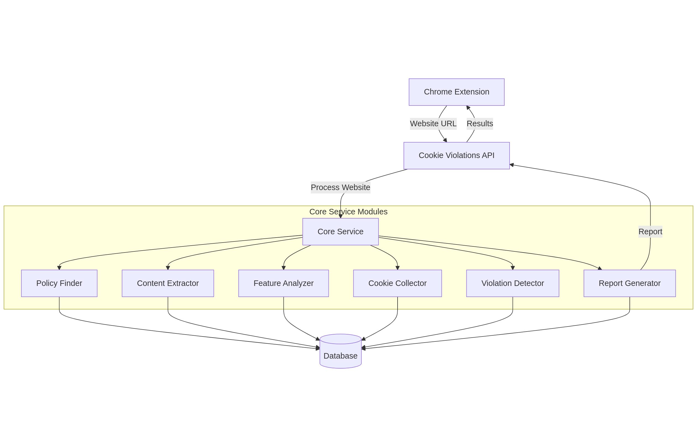

graph TD
    A[Chrome Extension] -->|Website URL| B[Cookie Violations API]
    B -->|Process Website| C[Core Service]

    subgraph "Core Service Modules"
        C --> D[Policy Finder]
        C --> E[Content Extractor]
        C --> F[Feature Analyzer]
        C --> G[Cookie Collector]
        C --> H[Violation Detector]
        C --> I[Report Generator]
    end

    D --> J[(Database)]
    E --> J
    F --> J
    G --> J
    H --> J
    I --> J

    I -->|Report| B
    B -->|Results| A

