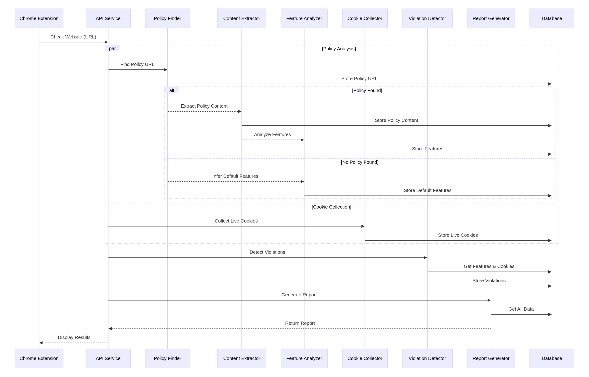

sequenceDiagram
    participant Extension as Chrome Extension
    participant API as API Service
    participant Finder as Policy Finder
    participant Extractor as Content Extractor
    participant Analyzer as Feature Analyzer
    participant Collector as Cookie Collector
    participant Detector as Violation Detector
    participant Reporter as Report Generator
    participant DB as Database

    Extension->>API: Check Website (URL)

    par Policy Analysis
        API->>Finder: Find Policy URL
        Finder->>DB: Store Policy URL

        alt Policy Found
            Finder-->>Extractor: Extract Policy Content
            Extractor->>DB: Store Policy Content
            Extractor-->>Analyzer: Analyze Features
            Analyzer->>DB: Store Features
        else No Policy Found
            Finder-->>Analyzer: Infer Default Features
            Analyzer->>DB: Store Default Features
        end
    and Cookie Collection
        API->>Collector: Collect Live Cookies
        Collector->>DB: Store Live Cookies
    end

    API->>Detector: Detect Violations
    Detector->>DB: Get Features & Cookies
    Detector->>DB: Store Violations

    API->>Reporter: Generate Report
    Reporter->>DB: Get All Data
    Reporter-->>API: Return Report

    API-->>Extension: Display Results

